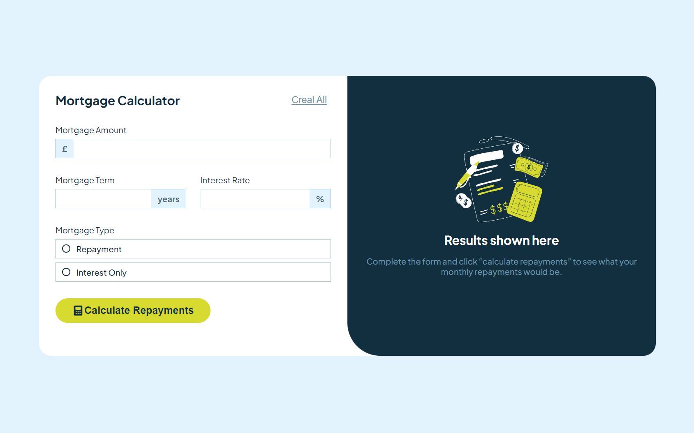

# Frontend Mentor - Solución del reto Mortgage repayment calculator

Esta es una solución al [Desafío de calculadora de amortización de hipotecas en Frontend Mentor](https://www.frontendmentor.io/challenges/mortgage-repayment-calculator-Galx1LXK73).

## Table of contents

- [Visión general](#Visión-general)
  - [The challenge](#El-reto)
  - [Captura de Pantalla](#Captura-de-Pantalla)
  - [Links](#links)
- [Mi proceso](#mi-proceso)
  - [Creado con](#creado-con)
- [Author](#author)

## Visión general

### El reto

Users should be able to:

Los usuarios deben poder:

- Introducir información sobre la hipoteca y ver los importes de la amortización mensual y total tras enviar el formulario.
- Ver mensajes de validación del formulario si algún campo está incompleto
- Rellenar el formulario sólo con el teclado
- Ver el diseño óptimo de la interfaz en función del tamaño de la pantalla de su dispositivo.
- Ver los estados «hover» y «focus» de todos los elementos interactivos de la página.

### Captura de Pantalla

### Links

- URL de la solución en Github: [Add solution URL here](https://github.com/dCris96/Mortgage-calculator)
- URL de la demo: [Add live site URL here](https://dcris96.github.io/Mortgage-calculator/)

## Mi proceso

### Creado con

- Marcado HTML5 semántico
- Propiedades CSS personalizadas
- Flexbox
- CSS Grid
- Flujo de trabajo mobile-first

## Author

- Website - [Add your name here](https://www.your-site.com)
- Frontend Mentor - [@yourusername](https://www.frontendmentor.io/profile/yourusername)
- Twitter - [@yourusername](https://www.twitter.com/yourusername)